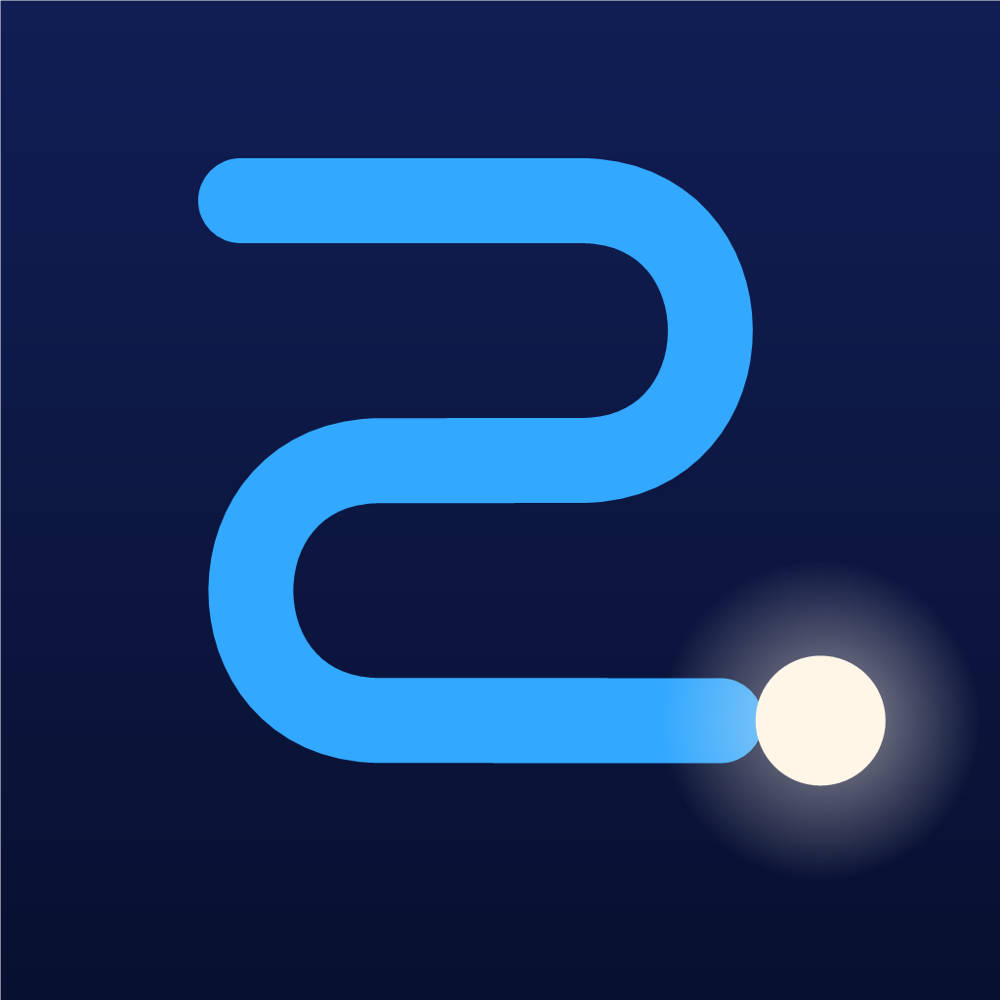
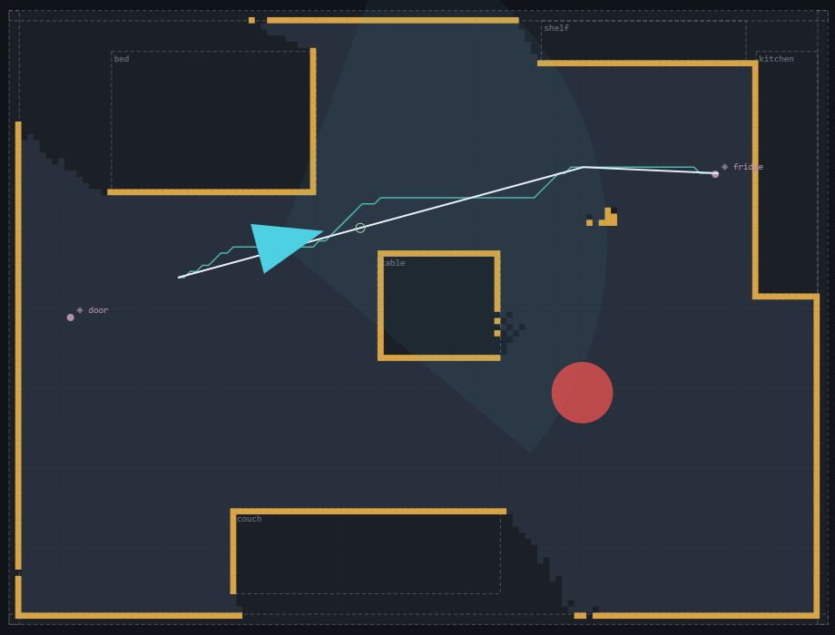
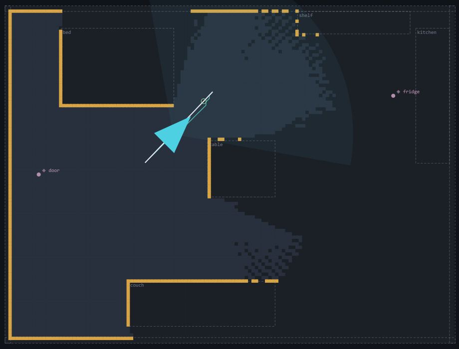
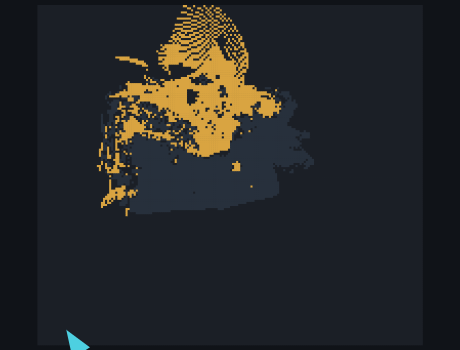

<div align="center">


# Theseus

**A home inventory app with a spatial brain** — scan rooms with an
iPhone, let AI name and value everything in them, and get
insurance-grade records out: claim PDFs, sealed move-in/out evidence,
QR-labeled storage boxes, and a map that knows where things are.

[](https://github.com/anish-agr/theseus/actions/workflows/ci.yml)
[](https://github.com/anish-agr/theseus/actions/workflows/ios.yml)

</div>

Theseus is three codebases that share one behavioral contract:

1. **`engine/`** — a spatial-navigation engine in pure Python
   (standard library only): occupancy world model, A* and D* Lite
   planners, VFH steering, pure-pursuit guidance, a navigation state
   machine, and a deterministic simulator. 90 tests, including
   property tests and golden traces that freeze behavior
   byte-for-byte.
2. **`apps/navcore/`** — the same engine ported line-by-line to a
   Swift package, verified against fixtures generated *by the Python
   engine* and proven by replaying all golden scenarios
   frame-for-frame. Builds and tests on Linux and Windows; no
   Apple-only dependencies.
3. **`apps/ios/`** — the shipped iPhone app (SwiftUI, SwiftData,
   ARKit) that runs NavCore live: rooms are scanned into the same
   occupancy grid the desktop tooling uses, objects are captured,
   recognized, and organized into an insurance-ready inventory.

Alongside them, **`learning/`** holds four ML lanes — monocular depth,
detection waypoints, PPO steering, map inpainting — trained CPU-only
and validated on real footage, with results reproduced by exported
artifacts ([learning/RESULTS.md](learning/RESULTS.md)).

The perception stack does not require LiDAR: ARKit plane anchors and
filtered feature points feed the occupancy model, with monocular-depth
pseudo-LiDAR as the designed upgrade path. Development does not
require a Mac: the engine and tooling run anywhere Python runs
(including Windows), and the iOS app is compiled by CI on macOS
runners into an installable IPA ([docs/NO-MAC.md](docs/NO-MAC.md)).

<div align="center">

<br><em>The guidance demo in the trace viewer: a studio apartment is
mapped with a limited-FOV sensor, then the agent is guided to the
fridge while a person paces across the route — 7 incremental D* Lite
reroutes, zero collisions.</em>
</div>

> **Naming.** In 1950, Claude Shannon built *Theseus*, a mechanical
> mouse that learned to solve a maze — arguably the first
> machine-learning demo. In the myth, Theseus survives the labyrinth
> by following Ariadne's thread. The project is both: classical
> pathfinding first, learned behavior layered on top.

## Running it

The engine and demos need only Python:

```bash
git clone https://github.com/anish-agr/theseus
cd theseus
python -m pytest engine learning -q     # 113 tests
python engine/scripts/generate.py       # regenerate demo traces + goldens
python engine/scripts/showcase.py       # fit-through, exits, coverage, semantic queries
python -m http.server 8123              # trace viewer:
#   http://localhost:8123/tools/viewer/index.html?trace=demo-trace.jsonl
#   ...?trace=explore-trace.jsonl   ?trace=walk-trace.jsonl   ?trace=depth-trace.jsonl
```

The Swift engine runs anywhere Swift does:

```bash
swift test --package-path apps/navcore   # 42 tests incl. golden replays
```

The app builds in CI: every push produces an unsigned `Theseus.ipa`
artifact under the
[ios workflow](https://github.com/anish-agr/theseus/actions/workflows/ios.yml),
installable with AltServer and a free Apple ID
([docs/INSTALL.md](docs/INSTALL.md)).

## Architecture

**One world model, many solvers.** Every feature is a query over the
same occupancy grid; features never talk to sensors and never own
private maps:

```
scan  →  world model  →  solver  →  guidance / rendering
         (occupancy,      (A*, D* Lite, flow fields,
          clearance,       frontier, coverage, fit-through,
          semantics)       semantic queries)
```

This is what keeps feature cost low: fit-through queries, evacuation
routes, and "nearest seat" are each ~20–80 lines, because the grid
already maintains clearance, semantics, and a single cost model. The
full architecture document, including the perception-provider
abstraction and the on-device actor pipeline, is
[docs/ARCHITECTURE.md](docs/ARCHITECTURE.md).

## Engine internals

### World model (`grid.py`)

A dense 2.5-D occupancy grid over one floor (5–6 cm cells). Each cell
holds a log-odds occupancy estimate (+0.85 per "occupied" observation,
−0.6 per "free"), an optional semantic label, and a last-seen tick.
Log-odds are **bounded** to [−1.8, 2.5] — standard practice for
dynamic environments, because saturation limits how much contrary
evidence a flip requires: a corridor that has been free for ten
minutes registers a person stepping into it within ~3 observations
instead of ~6. Cells derive three states (UNKNOWN / FREE / OCCUPIED)
from thresholds at ±0.7; out-of-bounds reads as OCCUPIED, so the world
ends in a wall.

A **clearance field** — octile distance in meters to the nearest
occupied cell, computed by multi-source Dijkstra — is cached lazily
and invalidated only when the occupied set changes. It can be capped
(nothing downstream consumes clearance beyond ~1.2 m) and throttled by
the controller. Clearance drives safety margins, cost shaping,
steering admissibility, corridor-width cues, and fit-through queries.

Policy decisions baked into the golden fixtures:

- **Unknown space is not traversable by default.** Guidance never
  routes a person through unseen space; mapping and exploration opt in
  via `PlanParams(unknown_ok=True)`.
- **Clearance counts occupied cells only.** Unknown cells are already
  untraversable; counting them would forbid walking a known-free
  corridor that runs beside an unscanned wall.
- **No ambient decay.** A stale "someone was here" cell is precisely
  what forces D* Lite to replan, and re-observation clears it.
- **Edge costs are directed.** An edge requires its *destination* to
  be fully traversable (state + clearance) but its *source* only to be
  non-occupied — where the agent stands is a fact, not a planning
  choice, and without this rule an agent nearer to a wall than the
  safety radius could never plan its way out. Diagonal moves must not
  cut corners: both shared cardinal neighbors must be passable.
- **One cost function.** `edge_cost` = step length × the mean of the
  endpoint cell costs, where cell cost rises linearly as clearance
  falls below the safety margin. It is defined once and consumed by
  A*, D* Lite, flow fields, smoothing, and steering alike — the
  equivalence property tests depend on every consumer seeing identical
  numbers.

### Planners (`astar.py`, `dstar_lite.py`)

**A\*** is the optimal reference. The heuristic (octile distance ×
cell size) is admissible and consistent because the minimum cell cost
is 1.0; with the heuristic disabled the same function is plain
Dijkstra, which the tests use as an independent optimality oracle.
**Path smoothing** turns grid staircases into the shortest sequence of
straight segments whose entire corridor remains traversable at the
agent's body radius.

**D\* Lite** (Koenig & Likhachev, 2002) is the planner that runs live.
The world model changes every few sensor ticks — a person walks
through a corridor, a chair moves — and replanning from scratch on
every change wastes nearly all of its work. D* Lite searches
*backward* from the goal, maintaining for each vertex a best-known
cost `g` and a one-step lookahead `rhs`; the priority queue holds
exactly the inconsistent vertices (`g ≠ rhs`). When observations
change edge costs, `notify_changed` re-queues only the affected
region; when the agent moves, the `k_m` key-modifier trick shifts
queue priorities in O(1) instead of recomputing heuristics queue-wide.
Mid-route repairs measure in single-digit milliseconds in interpreted
Python.

Two implementation choices worth noting:

- `rhs` values are recomputed exactly (a full min over successors)
  rather than via the paper's incremental shortcuts — a few extra
  neighbor evaluations per touched vertex in exchange for eliminating
  the subtlest class of D* Lite bugs.
- The priority queue uses lazy deletion with sequence-numbered
  entries, and the property suite asserts that across randomized world
  edits and agent moves, D* Lite's path cost equals a from-scratch A*
  plan **every time**. That equivalence is the engine's central
  correctness guarantee.

### Steering (`steering.py`)

Reactive local control in the Vector Field Histogram family: headings
are discretized into 36 sectors, each sector's free distance is
measured by clearance-aware ray marching, and sectors are scored by
openness, goal alignment, and heading-keeping. Two details carry the
design:

- **Hysteresis** — a bonus for the previous choice, a minimum commit
  time, and a switch margin. Without them, tiny occupancy changes flip
  the winning sector every tick and the output (or the haptic cue
  derived from it) oscillates.
- **An explicit BLOCKED outcome** instead of picking the least-bad
  sector, so the state machine can escalate to a replan rather than
  letting the agent flail.

`SteeringPolicy` is a deliberate seam: the trained RL policy exports
behind the same `decide(grid, pose, goal_bearing)` signature for a
live classical-vs-learned comparison.

### Guidance (`guidance.py`)

Pure-pursuit over the smoothed path: the pose is projected onto the
path, a lookahead point is held a fixed arclength (0.9 m) ahead, and
the follower emits typed cues — `straight`, `turn_left`/`turn_right`
with the angle, `off_route`, `arrive` — each carrying distance,
bearing error, cross-track offset, and the local corridor width
(twice the clearance) for haptic intensity scaling. Cross-track
distance beyond the corridor limit triggers `off_route`, which the
controller turns into a replan from wherever the person actually is.
The angle convention (**positive = turn left**, headings CCW from +x,
+y up, meters everywhere) is pinned by dedicated sign tests.

### State machine (`fsm.py`)

Eight states (IDLE, MAPPING, PLANNING, GUIDING, WALKING, BLOCKED,
ARRIVED, RELOCALIZING) driven by one explicit transition table.
Illegal transitions raise rather than being ignored — on a device,
ARKit callbacks, the planner, and the UI all poke at navigation state
concurrently, and "which mode are we in" must have exactly one answer.
`TRACKING_LOST` is accepted from any active state, parks the machine
in RELOCALIZING, and remembers where it was so recovery resumes
seamlessly.

### Simulator and controller (`sim.py`, `controller.py`)

The simulator provides a ground-truth grid, a limited-FOV raycasting
sensor, simple kinematics, and deterministic movers (obstacles that
ping-pong along polylines and refuse to step through the agent).
Everything downstream of the estimated grid — planners, steering,
guidance, FSM — is production logic exercised unmodified; the
simulator stands in for ARKit and nothing else.

The controller fixes the per-tick order of operations: advance world →
sense → notify planner of changed cells → validate the current path →
replan incrementally if needed (through the FSM) → compute cue → steer
→ move → emit trace frame. Mapping runs optimistic planning (unknown
traversable, periodic full A*); guidance runs pessimistic (unknown is
a wall) on D* Lite. Walk mode gates motion on both sensor freshness
and a swept-body check against live cell states, with the gate radius
deliberately just under the body radius — at the body radius, legal
wall-skimming stalls.

### Additional solvers

- **Frontier exploration** (`frontier.py`, Yamauchi 1997) — a frontier
  cell is known-free space adjacent to unknown space. Frontiers are
  clustered (8-connected, components under 3 cells dropped as noise),
  ranked by real travel cost, and visited until none remain — at which
  point the reachable world is mapped. This termination condition is
  what the app reports as scan completion.
- **Flow fields** (`flowfield.py`) — cost-to-nearest-goal for *every*
  cell from one multi-source Dijkstra sweep, sharing the canonical
  edge cost. One field answers "from anywhere, which way" for a whole
  goal set: exits (evacuation), all approach cells of a semantic label
  (nearest-X queries). Property-tested against A* in the single-goal
  case.
- **Coverage** (`coverage.py`) — boustrophedon sweeps: vertical lanes,
  alternating direction, A* hops between reachable runs.
  `coverage_fraction()` reports the fraction of reachable floor the
  route actually passes near (98% in the studio demo), and the tests
  assert on that number.
- **Spatial queries** (`queries.py`) — `corridor_profile` samples
  corridor width along a route via the clearance field;
  `fits_through` answers "will an object of width w make it" and
  returns the pinch point (the demo apartment's is 0.60 m).
  `nearest_semantic` builds a flow field over every traversable cell
  *adjacent* to a matching label — approach points, because the cell
  beside the fridge is standable and the fridge's own cell is not.
- **Waypoint registry** (`waypoints.py`) — turns noisy object
  detections into stable named targets with three rules: proposals
  within a merge radius of a same-label waypoint reinforce it
  (position converges by confidence-weighted mean); accumulated
  confidence promotes it into a navigable destination; waypoints in
  view that fail to be re-sighted decay and die. Objects move; maps
  must forget.
- **Snapshots and diffs** (`serialize.py`) — run-length-encoded JSON
  snapshots of derived states + labels (a 19k-cell studio is a few
  KB), with a `diff` that yields labeled appeared/vanished reports —
  the "what changed since the last scan" feature in the app.

### Determinism and golden traces (`trace.py`)

Every demo writes a JSONL trace: one header, one line per tick, floats
rounded before serialization so traces are byte-stable and hashable.
Golden fixtures freeze the guidance, exploration, and walk scenarios;
CI hashes them, so any behavior change is visible in review as a
golden diff. The same schema is the contract with the HTML viewer and
with the app's on-device trace recorder — a phone scan opens in the
desktop viewer.

<div align="center">

<br><em>Frontier exploration mid-run. The agent selects frontier
clusters by travel cost and maps until no reachable unknown space
remains.</em>
</div>

## The Swift port (`apps/navcore`)

The port's parity contract is mechanized:
`engine/scripts/gen_swift_fixtures.py` has the Python engine emit
(input, expected-output) batteries directly into the Swift test
target, so every module is tested against the reference
implementation's actual numbers. 42 tests culminate in golden replays
— NavCore re-simulates the three golden scenarios frame-for-frame,
including the mid-route D* Lite repairs. The package builds on Linux
in CI, which also proves it never acquires an Apple-only dependency.

Reaching frame parity required handling real cross-language
divergences, documented in [docs/PORT.md](docs/PORT.md):

- Python's `round()` is banker's rounding (half-to-even); Swift's
  `.rounded()` is half-away-from-zero.
- Python's float `//` is neither Swift truncation nor `floor(a/b)`:
  IEEE division rounds the quotient first, so `floor(0.5 / 0.05)` is
  `10` while Python computes `9` via an fmod-based algorithm. NavCore
  carries a port of CPython's `float_divmod`.
- Python dicts iterate in insertion order and the engine relies on
  that determinism; Swift dictionaries do not, so ordered sites sort
  explicitly or keep arrays.
- Identical IEEE-754 results require identical operation order, so the
  port preserves expression shapes; the binary heap reimplements
  `heapq`'s `(key, seq)` tie-breaking exactly.

## The iOS app (`apps/ios`)

SwiftUI + SwiftData + ARKit + RealityKit on iOS 17, with NavCore as
the spatial backbone. Five tabs: Home (search + quick actions), Scan,
Stuff, Rooms, Tools.

**Mapping.** `ARSessionManager` ingests plane anchors and
height-filtered feature points into a per-room occupancy grid (14 m ×
14 m at 5 cm cells). Elevated horizontal planes between 0.15 m and
1.8 m — tables, seats, shelves — are ingested as obstacles, since a
floor-only map renders furniture invisible to the planner. Each room
owns an ARWorldMap (the unit of relocalization), LZFSE-compressed on
disk, alongside a grid sidecar in the same `theseus-grid/1` format the
Python engine writes — a phone scan opens in the desktop trace viewer.
Scan completion is the frontier solver's termination condition, not a
percentage; progress is reported as m² mapped.

**Capture.** Capturing an object is a deliberate lock-on: Vision
saliency tracks the subject the camera is held on, a dwell timer
(2.2 s within ~5° of steadiness) arms the shutter, and a cooldown plus
a point-away requirement prevents re-triggering on the same object.
`VisionPipeline` runs Apple's on-device stack on the captured region —
classification (~1,300 classes), OCR, barcode detection, and a
`featurePrint` visual fingerprint used later for re-identification. A
blocklist keeps scene- and material-level labels ("textile",
"container") from ever becoming object names, letting more specific
lower-ranked classes surface instead. New captures merge against
existing things by distance and fingerprint similarity, so re-scanning
a room updates records instead of duplicating them.

**Naming cascade.** Display names resolve in order: classifier label →
visual-lookalike borrow from an already-named thing → batch AI pass →
text read off the object — with user-typed names never overwritten.
The batch AI pass is the primary identification mode: photos are sent
in multi-image requests and come back as names, descriptions,
categories, and replacement values with per-item confidence.

**AI layer** (`AIService`). Provider-agnostic behind one interface —
Gemini, Claude, or any OpenAI-compatible endpoint — with keys stored
in the Keychain and sent only as headers. Photos leave the device
exclusively on an explicit user action. The client absorbs real-world
API behavior with a self-healing retry loop: retired model IDs trigger
live model-list discovery and re-selection; request parameters that
one backend generation requires and the next rejects are dropped and
remembered; responses truncated by reasoning-token budgets retry with
4× the budget; rate limits wait out the server's own retry-delay hint;
overloads back off. Batch requests are paced, partial results survive
a failed chunk, and a published status line reports every state.
Storage itemization uses the model's per-item bounding boxes
(`box_2d`) to crop each item's thumbnail out of the shelf photo.

**Search.** Three on-device layers: stopword stripping (questions
become keywords), prefix/containment token matching (plurals,
end-typos), and Apple `NLEmbedding` word vectors (synonyms — "sofa"
finds the couch), with a rule that every meaningful query token must
match somewhere. A `TextImageEmbedder` protocol reserves the seam for
an optional CLIP model that would extend the same tolerance to
free-text descriptions of never-classified objects. Everything is also
indexed into Core Spotlight — system search deep-links straight into
locate — and exposed to Shortcuts via App Intents. Push-to-talk voice
("mark this", "what is this", "find my keys") runs on-device speech
recognition.

**Records.** SwiftData models (Place → Room → Thing, plus StorageSpot,
ConditionRecord, ScanSession, Doorway) hold queryable metadata; large
blobs live in files referenced by ID. On top of that sit the document
generators: room report PDFs, floor-plan PNGs, inventory JSON, a
claim-ready insurance dossier (serials, receipts, warranties, values
with provenance), move manifests with per-box checklists, sealed
SHA-256-hashed condition walkthroughs with a move-in/move-out
comparison PDF, and a full off-device backup (store-method zip writer,
~90 lines, no dependency). Receipts are read by on-device OCR — total
and purchase date — and recorded with "from receipt" provenance.

**Locate.** The default find experience keeps the camera up: a beacon
marks the thing in AR, a live card tracks distance and bearing, and
haptic ticks quicken as the distance closes. The direction arrow is
route-aware — it aims 0.75 m along an A* path recomputed at 1 Hz, so
it never points through a wall. Full turn-by-turn guidance (the
engine's cue stream rendered as haptics, voice, and a big-type HUD) is
one tap away.

The app is performance-tuned for 2018-era hardware (A12, the oldest
ARKit-capable devices without LiDAR): a 30 Hz AR frame budget,
change-based state publishing instead of per-frame, a minimap
rasterized to a single image blit, compressed world maps, and cached
thumbnails. The visual design follows a single-thread motif documented
in [docs/BRAND.md](docs/BRAND.md).

## ML lanes (`learning/`)

Four lanes feed the engine through existing seams — observations in,
policies behind existing interfaces. Full numbers and reproduce
commands: [learning/RESULTS.md](learning/RESULTS.md).

| lane | headline result |
|---|---|
| A — monocular depth → occupancy | real handheld video (TUM fr1_desk, mocap ground-truth poses) → coherent metric floor plan; **0/133** walked cells falsely blocked |
| B — detection → waypoints | fridge/ovens/table/chairs promoted from public clips through the merge/promote/decay registry, **zero ghost objects** |
| C — PPO steering | held-out success **0.90 / 0.90 / 0.87** vs scripted baseline 0.60 / 0.37 / 0.30 as movers increase; exported to a verified 78 KiB ONNX (256/256 action parity; held-out metrics reproduced by the exported artifact) |
| D — map inpainting | UNet vs nearest-known baseline on held-out rooms: accuracy **0.844** vs 0.770, IoU_occ **0.587** vs 0.388; strictly advisory — predicted cells are never traversable |

<div align="center">

<br><em>Lane A on real footage: occupancy recovered from handheld
video of a desk scene (TUM fr1_desk), aligned by per-frame affine fits
in inverse depth.</em>
</div>

Methodology notes: monocular depth is affine in *inverse* depth, so
metric alignment fits `1/z = s·r + t` per frame against sparse anchors
— the role ARKit feature points play on-device. The RL environment
wraps the engine's own simulator (egocentric 15×15 occupancy crop +
goal features; 10 discrete actions; the simulator enforces turn-rate
limits), and the reward is potential-based shaping on the flow-field
geodesic, which provably preserves the optimal policy while making the
reward dense. Evaluation is success rate and SPL against the true
shortest path on seed ranges disjoint from training.

## Build pipeline

The repository contains no generated Xcode project. `apps/ios/
project.yml` (XcodeGen) is the complete project definition, including
an explicit Info.plist — auto-generated plists silently omit
`CFBundleIconName` and fail App Store validation (ITMS-90713).

- `ci.yml` runs the Python suite and builds + tests NavCore on Linux
  on every push.
- `ios.yml` generates the Xcode project and builds an unsigned
  `Theseus.ipa` artifact on macOS runners; AltServer installs it with
  a free Apple ID.
- `testflight.yml` covers signed distribution, including generating
  the Apple signing certificate with OpenSSL on any OS.

## Repo map

```
engine/      Python navigation core (the reference) + 90 tests
apps/
  navcore/   Swift port, parity fixtures, golden replay tests
  ios/       the app: SwiftUI + SwiftData + ARKit, XcodeGen spec
learning/    ML lanes A–D, results, trained-model runners
fixtures/    room definitions + golden traces (hashed in CI)
tools/
  viewer/    zero-dependency HTML trace replay viewer
  icon/      app icon generator
  ci/        IPA validator, PowerShell lint
docs/        architecture, port guide, install routes, roadmap, brand
.github/     ci.yml · ios.yml · testflight.yml
```

## Where it's going

LiDAR mesh ingestion and house-scale room graphs with hierarchical
planning (M2), on-device monocular depth as pseudo-LiDAR for non-LiDAR
phones (M4), and the trained steering policy behind the engine's
`SteeringPolicy` seam with a live classical-vs-learned toggle (M5).
Details: [docs/ROADMAP.md](docs/ROADMAP.md).

## License

[MIT](LICENSE)
