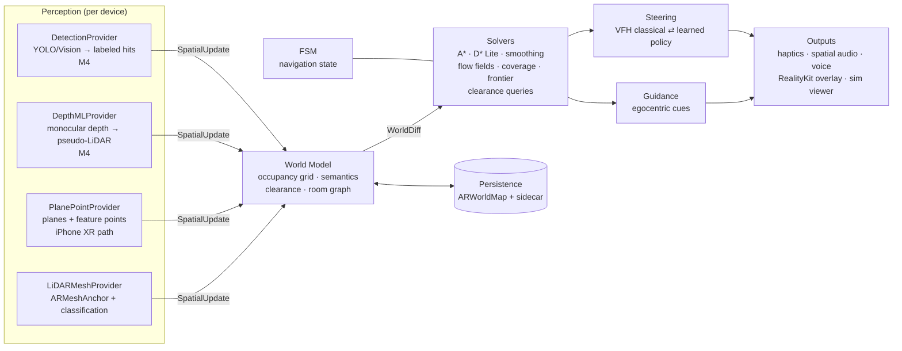

# Theseus architecture

## 0. North star

**One world model, many solvers.** Every feature — guide a person, patrol
an agent, "will the couch fit", "go to the fridge", "route me to the exit"
— is a *query over the same occupancy world model*. Features never talk to
sensors and never own private maps. This single rule is what makes the app
a "spatial OS" instead of a pile of demos:

```
scan → world model → solver → guidance/rendering
```

Three product principles fall out of it:

1. **The guided human is the hero.** The primary output of the system is a
   stream of egocentric cues a person can follow without looking at a map.
   A virtual agent is "just" a cue-follower with different kinematics.
2. **Perception is replaceable.** LiDAR mesh, plane+feature-point fallback,
   monocular-depth pseudo-LiDAR: all become the same normalized
   observations. Capability differences are configuration, not forks.
3. **Everything is replayable.** Every session — simulated or on-device —
   can be recorded as a trace and replayed through desktop tooling. Golden
   traces freeze engine behavior across the Python→Swift port.

## 1. System overview



The Python engine (`engine/`) implements everything from **World Model**
rightward, plus a simulator standing in for Perception. That is the part
being ported to Swift at M1; the Perception column is written natively
against ARKit and only ever built once.

## 2. World model (`grid.py`)

A dense 2.5-D occupancy grid per floor (5–6 cm cells). Per cell:

| field | meaning |
|---|---|
| log-odds occupancy | **bounded** (±~2) Bayesian evidence; bounded so a mapped-free corridor registers a person stepping in within ~3 observations |
| derived state | UNKNOWN / FREE / OCCUPIED (thresholded) |
| semantic label | "table", "kitchen", … from classification or detection |
| last-seen tick | staleness, future decay policies |

Plus a lazily-cached **clearance field** — octile distance (meters) to the
nearest OCCUPIED cell, computed by multi-source Dijkstra, cappable (nothing
consumes clearance beyond ~1.2 m) and only invalidated when the *occupied
set* changes. It powers: radius checks, corridor-center cost shaping,
steering admissibility, corridor-width cues, and fit-through queries
(`min_clearance_along`).

**Policy decisions (canonical, port must preserve):**

- *Unknown is a wall* for guidance; mapping/explore opt in via
  `PlanParams(unknown_ok=True)`. We never route a human through unseen
  space.
- *Clearance counts occupied cells only* — unknown space is already
  untraversable; counting it would forbid known-free corridors beside
  unscanned walls.
- *No ambient decay* — stale "someone was here" cells are exactly what
  triggers D* Lite repairs, and re-observation clears them.
- *Directed edges*: destination must be fully traversable; source only
  non-occupied (you can plan *out of* a tight spot you're standing in).
  Diagonals must not cut corners.
- *One cost function* (`edge_cost`): length × mean of endpoint cell costs,
  where cell cost rises linearly below `safe_margin` clearance. A* and
  D* Lite consume the identical function — their equivalence is property-
  tested and is the engine's central correctness guarantee.

**House scale (M2):** chunk the grid (~4 m tiles, serialized per chunk) and
add a topological **room graph** — rooms as nodes, doorways as portal edges
(RoomPlan detects doors on LiDAR devices; manual pinning on XR). Long
routes plan hierarchically: room graph first, metric grid within rooms.
Stairs become portal edges with metadata (multi-floor).

## 3. Solvers

- **A\*** (`astar.py`) — optimal reference; used where full plans are rare
  (mapping, offline queries). Property-tested against Dijkstra.
- **D\* Lite** (`dstar_lite.py`) — the planner that ships. Searches
  backward from the goal; `notify_changed(cells)` repairs only the affected
  region; `update_start` uses the km trick so the agent moving is ~free.
  Demo replans measure single-digit milliseconds mid-route in Python.
  Property-tested equal-cost to fresh A\* under random mutations + moves.
- **Smoothing** (`astar.smooth`) — greedy shortcutting whose corridors are
  verified traversable at the agent radius; output is the "thread" the
  human actually follows.
- **Future solvers over the same model:** Dijkstra **flow fields** from
  exits ("evacuation mode": follow the gradient from anywhere, even in the
  dark); boustrophedon **coverage** ("sweep the floor / find lost items");
  **frontier exploration** (agent auto-maps); **fit-through** (sweep a
  rectangle along a path via the clearance field: "the couch clears the
  hallway but not that corner"); **semantic queries** ("nearest seat").

## 4. Steering (`steering.py`)

Walk mode / local reactivity: VFH-style sector scoring — per-heading free
distance from clearance-aware ray marching, scored by openness + goal
alignment + heading-keeping + **hysteresis** (previous-choice bonus, commit
window, switch margin) so cues don't oscillate. Explicit BLOCKED outcome
escalates to the FSM instead of flailing.

`SteeringPolicy` is a deliberate seam: M5 drops a learned policy (PPO →
Core ML) behind the same `decide(grid, pose, goal_bearing)` signature, with
a diagnostic A/B toggle against the classical one.

## 5. Guidance — "Ariadne mode" (`guidance.py`)

Pure-pursuit style: project the pose onto the smoothed path, hold a
lookahead point ~0.9 m ahead, emit typed cues:

| cue | on-device rendering (M3) |
|---|---|
| `straight (d)` | steady haptic tick; beacon audio centered |
| `turn_left/right (θ)` | asymmetric haptic taps; PHASE audio beacon placed at the lookahead point so the turn is *heard* in space |
| `off_route` | distinct warning pattern + re-plan from wherever the user actually is |
| `arrive` | success pattern |
| corridor width | haptic intensity scales as the corridor tightens |

Cue geometry (esp. turn sign: +angle = left) is pinned by tests on Windows
long before a human trusts it. AirPods head tracking (CMHeadphoneMotion)
can later make beacon audio ego-accurate even when the phone is in a
pocket.

## 6. State machine (`fsm.py`)

IDLE · MAPPING · PLANNING · GUIDING · WALKING · BLOCKED · ARRIVED ·
RELOCALIZING, driven by an explicit transition table; illegal transitions
raise. TRACKING_LOST interrupts any active state and resumes exactly where
it left off — ARKit *will* lose tracking mid-guidance and the app must
degrade gracefully (freeze cues, tell the user, resume).

## 7. Perception layer (iOS, M1+)

All providers emit one normalized stream:

```swift
enum SpatialUpdate {
  case cells([CellObservation])        // occupied/free hits w/ confidence, label
  case pose(simd_float4x4, tracking: TrackingQuality)
  case anchorAdded/Removed(WaypointAnchor)
}
```

| capability | iPhone XR (A12, no LiDAR) | iPhone 12 Pro+ (LiDAR) |
|---|---|---|
| geometry | horizontal/vertical planes + `rawFeaturePoints`, statistically filtered (temporal persistence voting, density thresholds) into a 2.5-D heightfield | `sceneReconstruction = .meshWithClassification`; mesh triangles voxelized to grid |
| semantics | Vision/YOLO detections raycast into the map (M4) | native mesh classification + RoomPlan rooms/doors/furniture |
| depth | **DepthMLProvider (M4):** monocular depth (Depth Anything V2 S via Core ML/ANE) + camera intrinsics + gravity → pseudo-LiDAR point cloud. This is what makes the XR path genuinely good, and it's a headline ML deliverable | `sceneDepth` direct |
| known weakness | featureless walls/glass yield few points → conservative unknown handling + depth ML | glass/mirrors still lie |

Capability detection at launch selects providers; everything downstream is
identical.

## 8. Concurrency model (iOS, M1+)

Swift actors, not raw queues:

```
ARSession delegate (60 Hz)
  → AsyncStream<SpatialUpdate> (coalesced, ≤10 Hz batches)
  → WorldModel actor   (ingest diffs, clearance refresh ≤5 Hz)
  → Planner actor      (D* Lite; event-driven on diffs; budget ~5 ms)
  → Guidance/Steering  (15–30 Hz cue rate)
  → @MainActor         (RealityKit overlay, haptics, audio)
```

Rules: the render loop never waits on a planner; perception ingestion never
blocks on planning (diff queue with coalescing); planner output is
immutable snapshots. Thermal guardrails: duty-cycle mesh processing, drop
ingest rate before dropping cue rate — cues are the product.

## 9. Persistence (M2)

Two artifacts per space:

1. **`ARWorldMap` blob** — ARKit's relocalization data + `ARAnchor`s
   (named waypoints ride inside it). Note: mesh anchors are NOT stored;
   LiDAR devices re-mesh quickly after relocalization.
2. **Sidecar file (ours, versioned)** — grid chunks (occupancy +
   semantics + labels), room graph, waypoint metadata keyed by anchor
   UUID. This is what lets a scan made *last week* answer queries *now*,
   and what carries XR-built maps that ARKit itself can't reconstruct.

Flow: enter space → relocalize against world map → sidecar grid is live
immediately → new observations diff against it (D* Lite loves this).
"What changed since yesterday" falls out of chunk hash diffs — a fun
feature for ~free.

## 10. Trace schema (v1) & the port contract

JSONL: one header (grid dims, cell size, waypoints, furniture, sensor
spec) + one frame per tick (`pose`, FSM `state`, `occ` diffs, `path`,
`smoothed`, `cue`, `steer`, `movers`, `events`, `replan_ms`). Floats
rounded to 4 decimals; `replan_ms` is excluded from golden hashes
(behavior, not timing). The viewer (`tools/viewer/`) and golden tests both
consume it; the future on-device diagnostic recorder writes it.

**Port strategy (M1):** port module-by-module in dependency order
(geometry → grid → astar → dstar → steering → guidance → fsm), porting
each module's tests first, then replay the golden scenarios — the Swift
engine must reproduce the golden hashes. Use Swift stdlib `SIMD2<Float>`
etc. (cross-platform); Apple's `simd`/ARKit types only at the perception
boundary.

## 11. Risks & mitigations

| risk | mitigation |
|---|---|
| XR feature points too sparse (blank walls) | conservative unknown policy; plane boundaries; DepthML provider is prioritized *because* of this |
| ARKit drift / relocalization failure | RELOCALIZING state with resume; anchor-snapped waypoints; re-scan affordance |
| Python/Swift behavioral drift | golden traces + per-module ported tests |
| thermal throttling on A12 | rate budgets (§8), duty-cycled perception, no per-frame allocation in hot loops |
| guidance trust/safety (a human follows this) | unknown-is-wall policy, corridor-width cues, off-route detection, on-body test protocol before any real user |
| scope creep | roadmap gates; every feature must be expressible as a solver over the world model |
